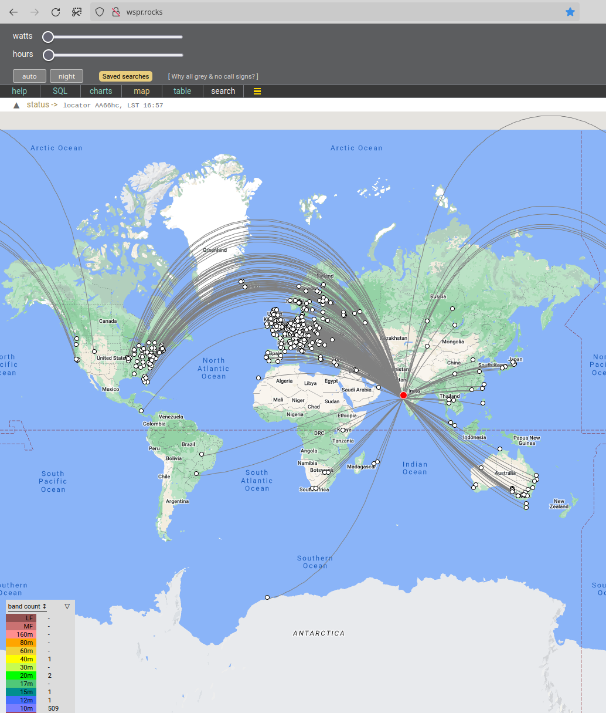
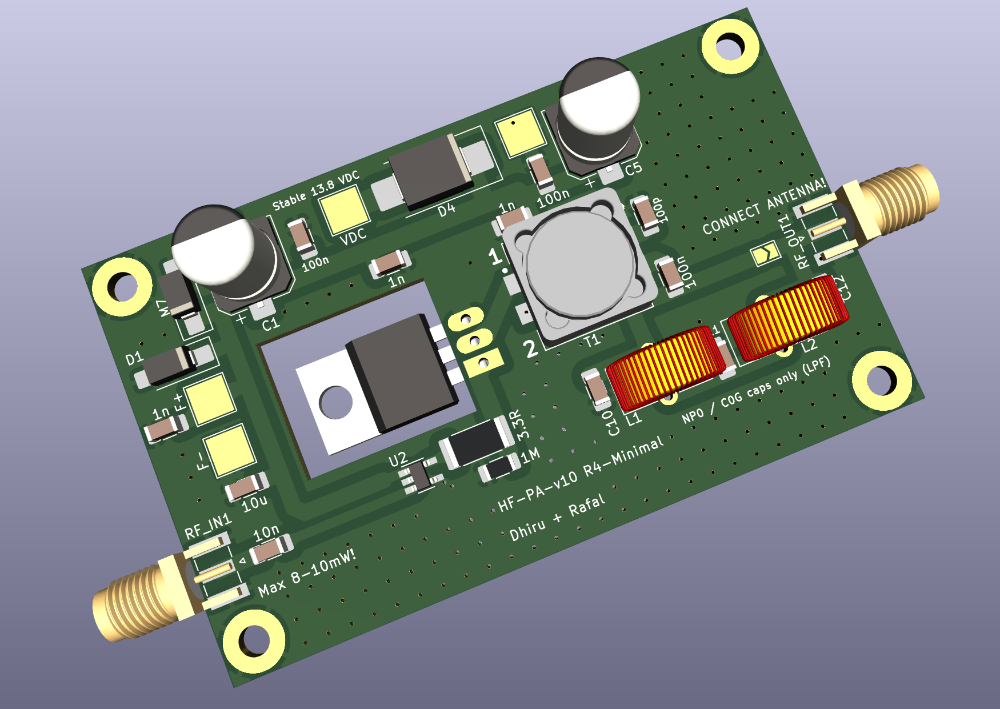
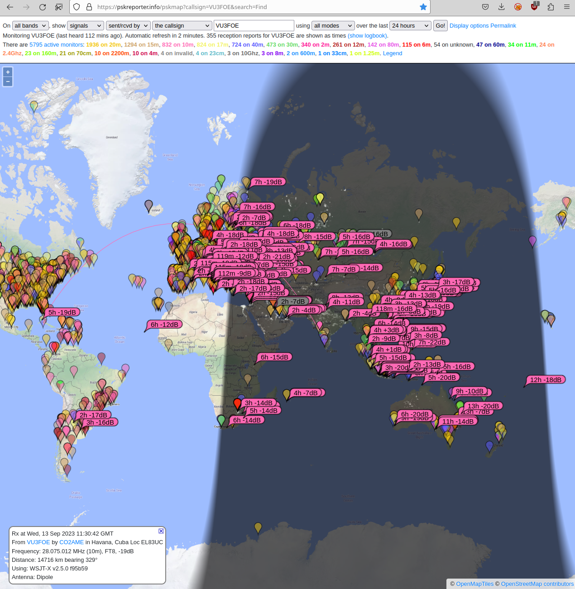

Why?

We need a QRP PA which does NOT blow up (unlike those 3xBS170 and 4xBS170
designs). We believe that if the FETs blow up (despite best practices and
intentions but under less-than-ideal external conditions), then the design has
FAILED!

[Inspirational Video Link](https://www.youtube.com/watch?v=4r7wHMg5Yjg)

Important update (February-2024): LC match for IRF510 @ 28 MHz. 7 turns FT50-6
and 220pF capacitor. Corrected PAE figure is around 50%. 30v @ drain produces
roughly 10W of clean'ish looking RF output. 24v @ drain produces 6W @ 28 MHz.
17v @ drain produces 3.7W.

March-2024 update: LC match for IRF510 @ 50 MHz. T50-6 4 turns and 180pF
capacitor. 24v @ drain produces clean'ish 28.8 Vpp (~2W). PAE is around 25%.
Such is life...



Update (29-September-2023): By removing the gate resistor, we firmly push the
amplifier into more Class-D operation. The MOSFET now remains as cool as a
cucumber!

Update (10-September-2023): The PCB was successfully validated!

Output is 7 to 8 W (before LPF) over a range of 160m to 10m as expected, with a
15V SMPS power supply. With a Pro-BPF attached, the power output is ~5W even at
28 MHz with IRF510! It even puts out 2W @ 50 MHz!

Amplifier characterization (@ 30.7 MHz for some reason, before LPF):

7 volts -> 2W

8 volts -> 3W

9 volts -> 3.5W

10 volts -> 4W

11 volts -> 5W

12 volts -> 6W

14 volts -> 8W

Efficiency is in the range of 45 to 50% which isn't bad ;)

Another result: 17 volts. 14 MHz. NKK LPF. 17.3W DC in. 57.6 clean Vpp on
scope. 8.3W clean RF output @ 48% efficiency!

BOM cost (minimal version): < 450 INR only - beat this! ;)

Note: HF-PA-v10 is also known as `CoolAMP (TM)`.

Build Notes:

- Use a 15V / 16v power supply.

- If you want to use a 13.8V power supply, then

  - Do NOT install the 78M12 regulator

  - Bridge the JP2 jumper

- Use adequate heatsinking. I use a 100x100x200 aluminium block with a 12v fan
  for doing WSPR activities. The MOSFET temperature stays under 45 degrees this
  way.

- PTT is active high - 3.3v is enough to trigger PTT.

- To skip the PTT sub-circuit, bridge the AOD407 MOSFET's source to drain.

- This amplifier can be directly driven by Si5351 (use 8mA drive setting)!

- IMPORTANT: For safety and RF output control, use a `10A DC-DC Step-down
  Adjustable Constant Voltage Module` or something similar.

  - https://robu.in/product/10a-dc-dc-step-down-adjustable-constant-voltage-module/




Results:




Fun on WSPR:


Note: I am using a 5-meter long EFHW antenna tuned for the 10m band along with
~45 meters of HLF-240 coax. Your results should be better than mine ;)

Quick Hacks:

I am using one v10 board (on low power setting of ~1 to 2W) to drive the second
v10 board.

The second v10 board has IRF530 on it. It uses a simple 3R3 SMD drain choke,
240nH inductor (8 turns on T50-6) + 470 pF LC match for the 20m band at the
output side.

The power output is 20W+ with 30v at the IRF530 drain. While this is fine for
FT8, we decrease the output power to 9 to 12W for WSPR mode (considering
derating, heat dissipation, fear of "flash over")


December-2023 update: We can now use IRFP140N (with its massive TO-247 package)
to generate around "20W" safely for WSPR. We drive the IRFP140N MOSFET directly
with the UCC driver chip now.

Settings: UCC driver at roughly 12v. With LC match set for 20m band (NB!).

IRFP140N @ 28v drain @ 14 MHz -> 22W

IRFP140N @ 28v drain @ 3.5 MHz -> 20W (for Rafal)

IRFP140N @ 28v drain @ 7 MHz -> 20W

We believe we can push 25W easily by feeding 14v to 15v to the UCC driver chip.

The "final" IRFP140N MOSFET remains as cool as a cucumber, pretty boring -
right? Where have the "exciting" days of the MOSFETs blowing up in your face
gone? Just kidding!

NB: To overcome antenna losses (~2.0 SWR 20m dipole), lossy 50m meters of
HLF-200 coax, we need to generate around 15W+ on the amplifier side.

```
In [1]: 15W * 0.88 (SWR losses) * 0.40 (coax losses)
Out[1]: 5.28
```

PA protection:

- We plan to use INA219 to monitor current consumption, and to terminate TX if
  anomalies are detected.

- Use `thermocouple` attached to the MOSFET's body using thermoglue to monitor
  the temperature, and to terminate TX if anomalies are detected.

New discoveries (via https://github.com/rafal-rozestwinski):

- Power output is 1 to 1.5W on 50 MHz.

  We can probably get 2 to 3W with some more work here (push the amp into more
  Class-D).

- The PA survives open and short conditions but protections are recommended in
  any case.

  - INA219 based current monitoring

  - Thermocouple based temperature monitoring

- We do NOT recommend the old-skool SWR monitoring approach due to its
  complexity (for end-users).


Learnings:

- Keep the IRF510's gate voltage <=14 volts.

  If the IRF510's gate voltage is too high (i.e. when IRF510 is over-driven),
  it results in super wide-band distorted noisy signal on the output - you
  don't want that ;)

  If you want to feed high voltages to IRF's drain, then use a regulator (12v)
  for powering the UCC driver chip.


Joining In:

Are you interested in such projects, and spam-free technical discussions?

If yes, you might be interested in joining [the 'HAMBREWERS' Telegram group](https://t.me/+TwzGyKGe8_QI_B3y).
